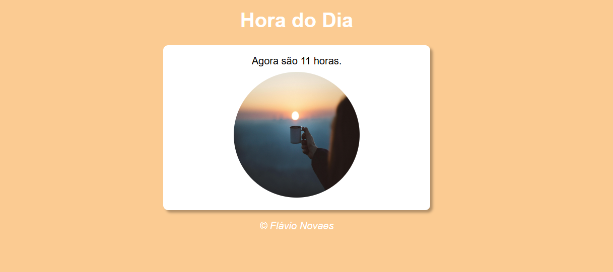
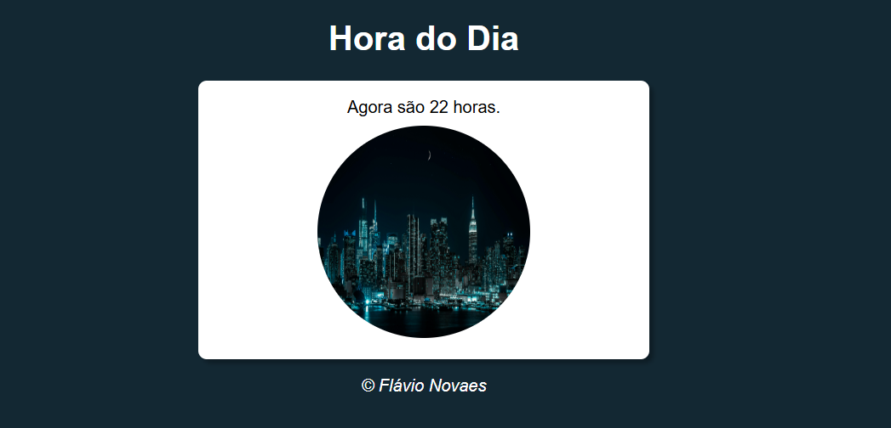

# 🌅 Hora do Dia

Projeto simples desenvolvido em **HTML, CSS e JavaScript**, que exibe a **hora atual do sistema** e altera dinamicamente a **imagem** e o **estilo da página** de acordo com o período do dia (manhã, tarde ou noite).

Este projeto foi desenvolvido com base nas aulas do Curso em Vídeo, ministradas por Gustavo Guanabara, como parte dos estudos iniciais em JavaScript.


---

## 🖼️ Preview do Projeto

### 🌅 Manhã


### ☀️ Tarde


### 🌙 Noite


## 🚀 Funcionalidades

- Detecta automaticamente a hora atual do sistema
- Exibe a mensagem com o horário atual
- Altera a imagem conforme o período do dia:
  - 🌅 Manhã  
  - ☀️ Tarde  
  - 🌙 Noite
- Modifica a cor de fundo de acordo com o horário
- Layout simples e responsivo

---

## 🛠️ Tecnologias Utilizadas

- **HTML5**
- **CSS3**
- **JavaScript**

---

## 📂 Estrutura do Projeto

```text
📁 Hora-do-Dia
├── index.html
├── style.css
├── script.js
└── img/
    ├── manha.png
    ├── tarde.png
    └── noite.png
```
---

## ▶️ Como Executar o Projeto

1. Faça o download ou clone este repositório:
```bash
git clone https://github.com/FlavioNovaes/Hora-do-Dia.git
```
2. Abra o arquivo index.html diretamente no navegador

---

## 📚 Aprendizados

Com o desenvolvimento deste projeto, foi possível praticar e compreender melhor:

- Manipulação do DOM com JavaScript
- Uso do objeto Date() para capturar a hora atual do sistema
- Estruturas condicionais (if, else if, else)
- Alteração dinâmica de imagens e estilos com JavaScript
- Integração entre HTML, CSS e JavaScript
- Organização básica de arquivos em um projeto web
